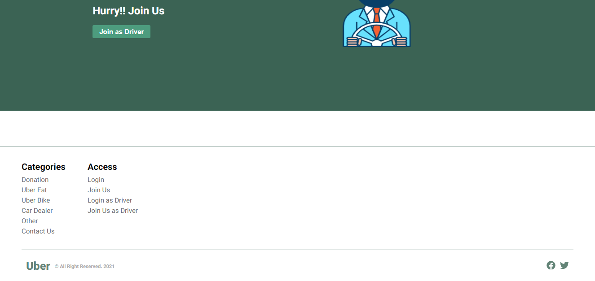
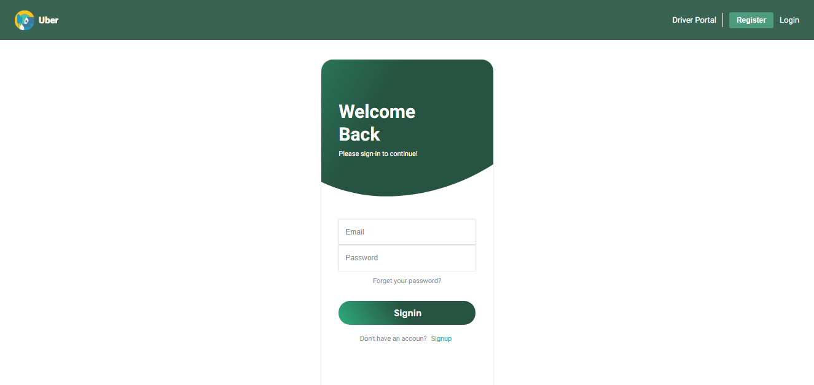
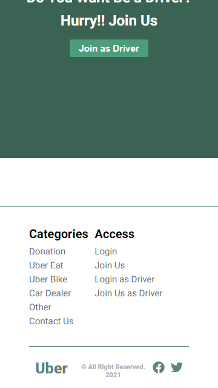
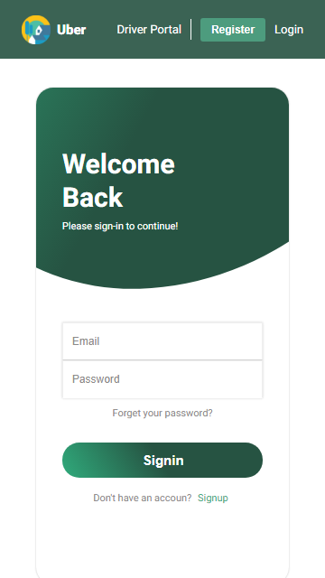

# **How to run this react app**

1. Install Node (Ignore if you already install)
2. Download this source code in `.zip` and extract or simplly Clone
3. Open Terminal and go to that directory
4. Install Node module just type `npm install` then install json-server by `npm i json-server`
5. then start the json-server `json-server --watch db.json --static ./src/images/thumbnails/ --port 9000`
6. then open another Terminal and start react app by `npm start`

## **Screenshot**
#### ***PC/Laptop View***

 

#### ***PC/Laptop View***

